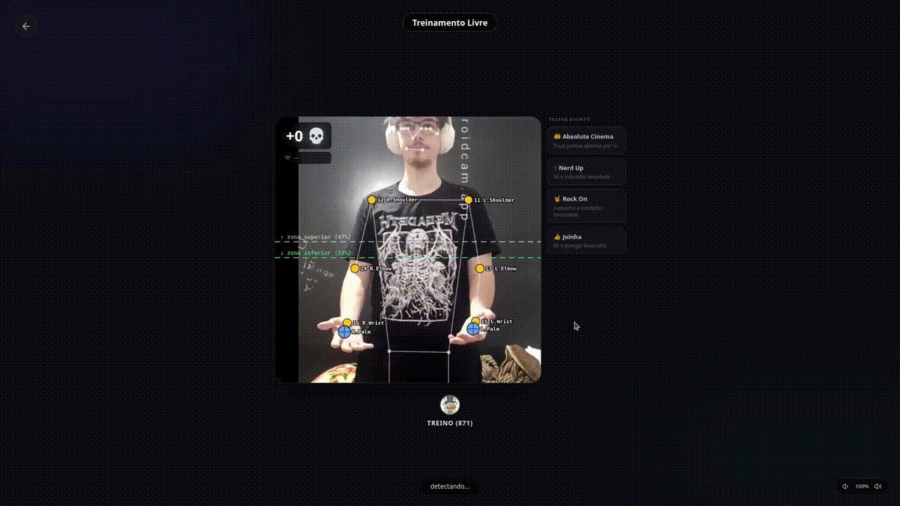
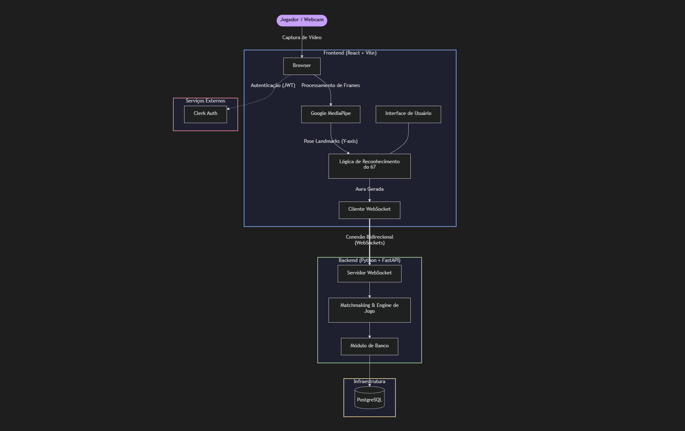
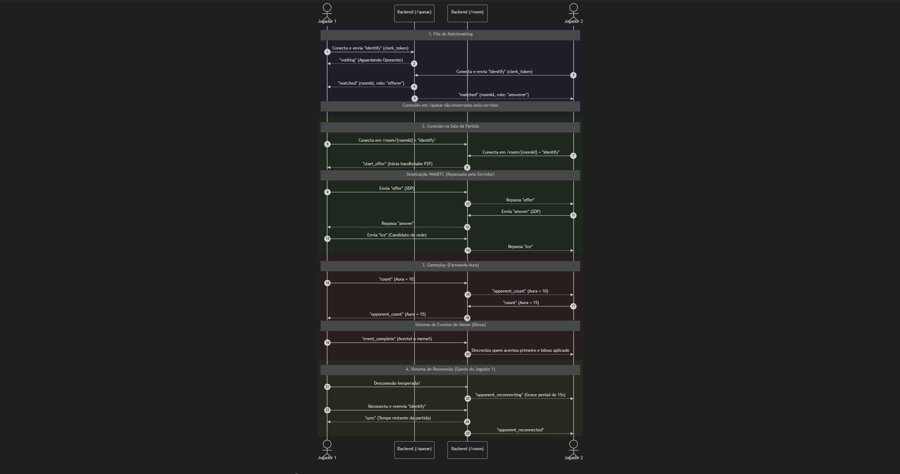
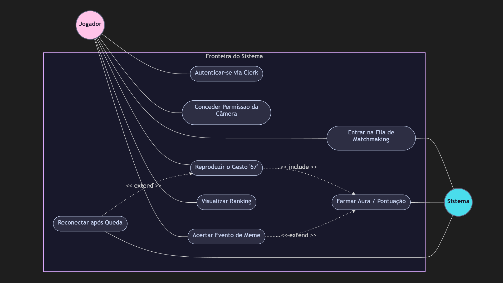

# Contador 67 💀

## 🤔 O que é o projeto e o meme 67?

Se você passa muito tempo no TikTok, já deve ter esbarrado na febre do "67" (ou *six-seven*). O meme nasceu de um vídeo de basquete e de um rap, se tornando o símbolo definitivo do humor "brain rot" da Geração Alfa. O gesto clássico? Ficar balançando as mãos para cima e para baixo, como se estivesse pesando duas opções em uma balança. Não significa nada profundo, e é justamente por isso que é tão genial!

Nós pegamos esse gesto absurdo e o transformamos em uma mecânica de jogo real!
* 👌 **Tracking (Client side)**: A mágica acontece direto no seu navegador. O sistema identifica os movimentos do seu corpo usando a câmera, mas de forma 100% local: o processamento roda na sua própria máquina e **nenhuma imagem sua é enviada para a internet**, garantindo privacidade total e respostas instantâneas.
* ⚖️ **Reconhecimento do Movimento**: Criamos uma lógica própria para identificar perfeitamente o movimento de "balança" do meme. O jogo entende o ritmo e a precisão em que você sobe e desce as mãos, convertendo o seu gingado em "aura" (pontos) na mesma hora.
* ⚔️ **Batalhas em Tempo Real**: Quer provar que você é o mestre do 67? Nosso modo online sincroniza os jogadores instantaneamente. Você entra em um lobby global e batalha lado a lado contra outra pessoa, vendo a pontuação de ambos subir ao vivo para ver quem leva a melhor!

## 🚀 Deploy

Você pode jogar e testar o projeto online agora mesmo!

# 🔗 **[CLIQUE AQUI](#)**

## 💻 Tecnologias Utilizadas

* **Frontend**: React, TypeScript, Vite e Tailwind CSS para uma interface rápida e responsiva.
* **Visão Computacional**: Google MediaPipe executando mapeamento corporal direto no navegador do cliente.
* **Backend & Multiplayer**: Servidor Python (FastAPI) lidando com conexões WebSocket em tempo real.
* **Infraestrutura**: PostgreSQL para o ranking, Docker para conteinerização e Clerk para autenticação.

## 📁 Estrutura de Diretórios (Monorepo)

```text
.
├── frontend/             # Aplicação web React + Vite
│   ├── src/
│   │   ├── assets/       # Mídias, fontes e sprites
│   │   ├── components/   # Componentes visuais isolados
│   │   ├── hooks/        # Regras de negócio e integração MediaPipe/WebSockets
│   │   ├── lib/          # Utilitários de sistema e formatação
│   │   └── pages/        # Telas principais (Lobby, Room, Sobre, etc)
│   ├── package.json      # Dependências
│   └── Dockerfile        # Build do container Nginx do Front
│
├── server/               # API backend em Python + FastAPI
│   ├── auth.py           # Camada de autenticação integrada com o Clerk
│   ├── db.py             # Configuração e queries do PostgreSQL
│   ├── game.py           # Engine das partidas, lógica de "Aura" e Matchmaking
│   ├── player_routes.py  # Rotas REST para gerenciamento de perfil e histórico
│   ├── ws_routes.py      # Gerenciamento de WebSockets (Multiplayer em tempo real)
│   ├── schema.sql        # Tabelas e relacionamentos do Banco de Dados
│   ├── server.py         # Entrypoint que inicializa a aplicação FastAPI
│   └── Dockerfile        # Build do container Python do Backend
│
└── README.md             # Esta documentação
```

---

## ⚙️ Setup Inicial (Local)

Passo a passo para começar a farmar aura rodando o projeto localmente no seu computador.

### ⚠️ Ajuste para usuários Windows

Se você estiver usando Windows, abra o arquivo:

```text
frontend/package.json
```

Encontre:

```json
"build": "tsc -b && vite build"
```

Altere para:

```json
"build": "vite build"
```

---

### 🐳 Passo 1: Crie o arquivo `docker-compose.yml`

Na raiz do projeto, crie um arquivo chamado `docker-compose.yml` com o seguinte conteúdo:

```yaml
services:
  backend:
    build: ./server
    ports:
      - "8765:8765"
    environment:
      - DATABASE_URL=postgresql://postgres:postgres@db:5432/contador67
      - CLERK_SECRET_KEY=SUA_CLERK_SECRET_KEY
    depends_on:
      - db

  db:
    image: postgres:15-alpine
    restart: always
    environment:
      POSTGRES_USER: postgres
      POSTGRES_PASSWORD: postgres
      POSTGRES_DB: contador67
    ports:
      - "5432:5432"
    volumes:
      - pgdata:/var/lib/postgresql/data

  frontend:
    build:
      context: ./frontend
      args:
        - VITE_SERVER_URL=http://localhost:8765
    ports:
      - "80:80"

volumes:
  pgdata:
```

---

### 🔐 Passo 2: Crie uma conta no Clerk

Acesse:

```text
https://dashboard.clerk.com/
```

1. Crie sua conta.
2. Faça login.
3. Clique em **Create Application**.
4. Finalize a configuração inicial.

---

### ⚙️ Passo 3: Configure o Frontend

Dentro da pasta `frontend`, crie um arquivo chamado `.env`.

Após criar sua aplicação no Clerk, copie sua chave pública (**Publishable Key**) e preencha o arquivo:

```env
VITE_CLERK_PUBLISHABLE_KEY=sua_publishable_key
VITE_SERVER_URL=http://localhost:8765
```

Você encontrará a Publishable Key no painel do Clerk.

---

### 🚀 Passo 4: Suba os containers

Na raiz do projeto execute:

```bash
docker compose up --build
```

Aguarde a construção dos containers.

---

### 🎉 Passo 5: Comece a farmar aura

Frontend:

```text
http://localhost
```

Backend:

```text
http://localhost:8765
```

---

## 🎥 Demonstração do Sistema

### Teste Local


<br>

### Multiplayer


<br>

### Multiplayer Com Evento


---

## Diagramas de Eng. de Software ☝️🤓 (para agradar nosso professor) 

#### Diagrama de Arquitetura


<br>

#### Diagrama de Sequência


#### Diagrama de Casos de Uso

